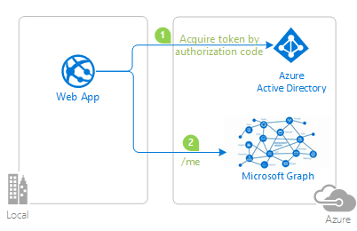

# Integrate Microsoft identity into a Java web application using OpenID Connect and call Microsoft Graph

> Note: This sample is Work In Progress

### Overview

This sample demonstrates a Java web application signing in a user and calling the Microsoft Graph API that is secured using Azure Active Directory.

1. The Java web application uses the [Gluu OpenID Connect library](https://github.com/GluuFederation/oxAuth) to obtain an id token and access token from Azure Active Directory (Azure AD).

2. The id token represents the user's authentication and the access token is used as a bearer token when calling the Microsoft Graph API.

For more information about how the protocols work in this scenario and other scenarios, see [Protocols](https://docs.microsoft.com/en-us/azure/active-directory/develop/active-directory-v2-protocols).

## How to run this sample

To run this sample, you'll need to set up the following:

- Working installation of [Java](http://www.oracle.com/technetwork/java/javase/downloads/index.html) (8 and above) and [Maven](https://maven.apache.org/)
- Tomcat or any other J2EE container solution
- An Internet connection
- An Azure Active Directory (Azure AD) tenant. For more information on how to get an Azure AD tenant, see [How to get an Azure AD tenant](https://docs.microsoft.com/en-us/azure/active-directory/develop/quickstart-create-new-tenant)

### Step 1:  Clone or download this repository

From your shell or command line:

- `git clone https://github.com/Azure-Samples/active-directory-java-webapp-openidconnect-v2.git`

### Step 2:  Register the sample with your Azure Active Directory tenant

1. Sign in to the [Azure portal](https://portal.azure.com) using either a work or school account or a personal Microsoft account.

1. If your account gives you access to more than one tenant, select your account in the top right corner, and set your portal session to the desired Azure AD tenant.

1. In the left-hand navigation pane, select the **Azure Active Directory** service, and then select **App registrations (Preview) > New registration**.

1. On the **Register an application** page, enter your application's registration information:
    - In the **Name** section, enter a meaningful application name that will be displayed to users of the app.
    - Under **Supported account types**, select **Accounts in any organizational directory and personal Microsoft accounts (e.g. Skype, Xbox, Outlook.com)**.
    - Add http://localhost:8080/websample/secure/aad in **Reply URL**, and click Register.
    - In the succeeding page, Find the *Application ID* value and record it for later. You'll need it to configure the configuration file for this project.

1. Select **Certificates & secrets** in left-hand navigation pane. Under **Client secrets**, add **New client secret**.
    - Type a key description
    - Select a key duration of either **In 1 year**, **In 2 years**, or **Never Expires**.
    - When you save this page, the key value will be displayed, copy, and save the value in a safe location.
    - You'll need this key later to configure the project. This key value will not be displayed again, nor retrievable by any other means, so record it as soon as it is visible from the Azure portal.

### Step 3:  Configure the sample to use your Azure AD tenant

Open `web.xml` in the webAppDemo/src/main/webapp/WEB-INF/ folder. Fill in with your tenant and app registration information noted in registration step.
- Replace '{tenantId}' with the tenant Id or name if you want to restrict sign in to users in your tenant only
- Replace 'AppClientId' with the Application Id
- Replace 'AppClientSecret' with the key value noted above.
- Replace 'AppRedirectUri' with Reply URL created from above step.

### Step 4: Package and then deploy the war file.
On the command line, under the *WebAppDemo* folder, run:

`mvn clean package`

This will generate a *websample.war* file in your */targets* directory. Deploy this war file using Tomcat or any other J2EE container solution. To deploy on Tomcat container, copy the .war file to the *webapps* folder under your Tomcat installation and then start the Tomcat server.

This WAR will automatically be hosted at
`http://<yourserverhost>:<yourserverport>/websample/``

Example: http://localhost:8080/websample/

You're done!

Click on "Sign in user and call Microsoft Graph" to start the process of logging in.
Once you login, you will be displayed the user profile information such as Name obtained from Microsoft Graph.

## Help and Support
1. For more documentation on GLUU, see https://gluu.org/docs/ce.

1. For more information about how the Azure AD protocols work in this scenario, see [OpenID Connect](https://docs.microsoft.com/en-us/azure/active-directory/develop/v2-protocols-oidc) and [Auth code flow](https://docs.microsoft.com/en-us/azure/active-directory/develop/v2-oauth2-auth-code-flow).

1. If you find a bug in the sample, please raise the issue on GitHub Issues. Please open any issues with the library, directly on the [GLUU library GitHub](https://github.com/GluuFederation/oxAuth) repo.

## Credits
This code has been inspired originally https://www.gluu.org/blog/java-openid-connect-servlet-sample/ and has been modified to suit the Microsoft [Azure AD protocol](https://docs.microsoft.com/en-us/azure/active-directory/develop/active-directory-v2-protocols).
